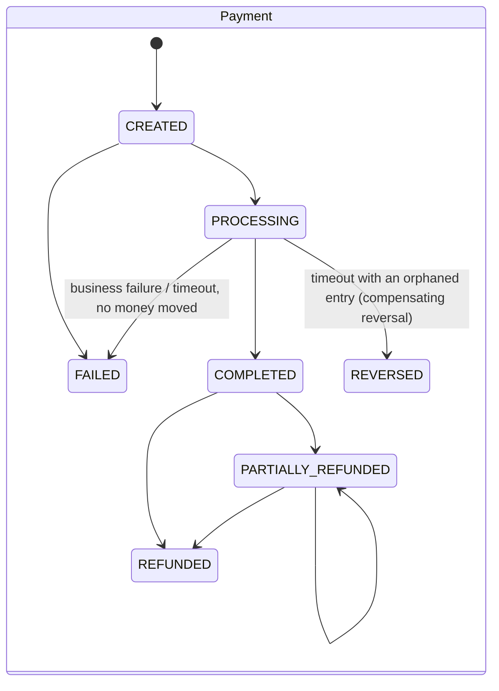

# PayCore Backend

The backend for a multi-currency wallet platform (PKR, AED, USD). It is a NestJS and TypeScript **modular monolith** that runs on PostgreSQL and Redis. There is **no Docker**: PostgreSQL is hosted on Supabase and Redis on Redis Cloud.

* **Phase 1:** auth, users, kyc, ledger, wallets (wallets includes the FX conversions and the synchronous sandbox rail).
* **Phase 2:** transfers (P2P, cross-currency, payment requests), payments (engine and state machine), qr, funding (bank adapter, webhooks, reconciliation), merchants (KYB, outlets, MDR, refunds), settlement (T+N batches), activity (unified feed and CSV statements), jobs (outbox relay and BullMQ worker).

**Hosting:** the database is **Supabase PostgreSQL, used only as a database** (no Supabase Auth, Storage or Realtime; the NestJS API owns auth). Redis is a separate **hosted Redis Cloud** instance over TLS.

| Concern | Choice |
|---|---|
| Language | TypeScript, `strict` + `noImplicitOverride` + `noImplicitReturns` + `isolatedModules` |
| Framework | NestJS 11 (Express 5) |
| DB / ORM | Supabase PostgreSQL with Prisma 6 migrations, plus hand-written SQL for integrity triggers, CHECK constraints, partial indexes and RLS lockdown |
| Cache / queues | Redis Cloud over `rediss://` (ioredis 5), `noeviction`. Stores the FX rate cache, throttling counters, OTP cooldowns and BullMQ queues |
| Background work | Transactional outbox in PostgreSQL, relayed to BullMQ; a separate worker process (`src/worker.ts`) |
| Auth | Phone + password (argon2id), OTP, JWT access tokens, rotating refresh tokens, device sessions |
| Logging | pino (`nestjs-pino`), JSON logs, `x-correlation-id` on every request and log line, secrets redacted |
| Config | Validated with zod at boot; the app refuses to start on invalid config |
| API docs | OpenAPI at `/docs` (JSON at `/docs/openapi.json`, exported to `openapi.json`); every request **and response** is typed; disabled in production |
| Tests | Jest unit tests, plus integration tests against a real throwaway PostgreSQL started from your local install |

---

## 1. Setup

### 1.1 Supabase (database only)

> ⚠️ **Free-tier Supabase projects pause after about a week of inactivity.** A paused project refuses connections, so the API fails its `/health` check and every DB call errors until you click **Restore** in the Supabase dashboard (it takes a few minutes). Upgrade the plan, or keep the project active, for anything beyond development.

1. Create a project and note the **database password**.
2. **Connection strings** (Dashboard → *Connect*):
   * `DATABASE_URL` is the **Transaction pooler** (Supavisor, **port 6543**). Append `?pgbouncer=true&connection_limit=10&pool_timeout=20`. `pgbouncer=true` is mandatory because transaction pooling can't hold prepared statements, and config validation rejects a 6543 URL without it.
   * `DIRECT_URL` is the **Direct connection** (`db.<ref>.supabase.co:5432`) or the **Session pooler** (port 5432). Prisma uses it only for `migrate`. On the free tier the direct host is IPv6-only, so use the session pooler if your network has no IPv6.
3. **Disable the Data API** (Dashboard → *Project Settings → Data API* → turn it off, or remove `public` from *Exposed schemas*). PayCore never uses PostgREST, and the database must be reachable only through the backend.
4. Run the migrations (below). The `rls_lockdown` migration **enables Row Level Security on every table with no policies** and revokes all privileges from Supabase's `anon` and `authenticated` roles, so even if the Data API were re-enabled it would expose nothing. The backend connects as the table owner (`postgres`), which is unaffected because RLS is *enabled*, not *forced*.
5. **Every migration that adds a table must also `ALTER TABLE … ENABLE ROW LEVEL SECURITY`** (the phase-2 migration does this for all 18 new tables). The integration test *"every table (including future ones) has row-level security enabled"* fails otherwise.
6. **Session time zone must be UTC** (the Supabase default). Timestamps are `timestamp(3)` columns holding UTC wall time; `DEFAULT now()` would store local wall time under any other session time zone. The test cluster is started with `timezone=UTC` for the same reason.

**Transaction-pooler compatibility.** Nothing in the code relies on session state: no advisory locks, `SET`, `LISTEN`/`NOTIFY` or prepared statements. Each interactive transaction runs on one pooled connection from `BEGIN` to `COMMIT`. Concurrency control is row locks plus snapshot isolation (section 3). The outbox relay uses `SELECT … FOR UPDATE SKIP LOCKED` inside a short transaction, which is pooler-safe.

### 1.2 Redis Cloud

1. Create a database (the free tier is fine) and copy its **public endpoint** and **default user password**.
2. Set the **Data eviction policy to `noeviction`** (database *Configuration*). Rate-limit counters, OTP cooldowns and queues must never be silently evicted. At boot the API reads `INFO memory` and **refuses to start in production** if the policy isn't `noeviction` (it only warns in development).
3. Use TLS: `REDIS_URL=rediss://default:<password>@<host>:<port>`. Production config validation requires `rediss://`.
4. BullMQ polls conservatively for free-tier command and connection quotas (`src/common/redis/bullmq.defaults.ts`): `BULLMQ_DRAIN_DELAY_SECONDS=30`, `BULLMQ_STALLED_INTERVAL_MS=60000`, `BULLMQ_WORKER_CONCURRENCY=2`, capped job retention (1000 completed / 24 h, 5000 failed / 7 days). The worker opens three connections (one for queues, one per worker).

### 1.3 Run the API and the worker
```bash
cd Backend
npm install
cp .env.example .env     # fill in DATABASE_URL, DIRECT_URL, REDIS_URL, JWT_ACCESS_SECRET, QR_SIGNING_SECRET, BANK_WEBHOOK_SECRET, ADMIN_*
npm run prisma:migrate   # prisma migrate deploy, over DIRECT_URL
npm run db:seed          # bootstrap ADMIN from ADMIN_PHONE / ADMIN_PASSWORD
npm run start:dev        # API on http://localhost:3000, docs at /docs
npm run start:worker:dev # worker (BullMQ consumers + repeatable jobs); `npm run build && npm run start:worker` in production
```
No Docker is used anywhere. With `QUEUE_DRIVER=inline` you can run the API alone (jobs run on in-process timers, no BullMQ); production requires `bullmq` and a worker.

### Tests
```bash
npm test                   # unit tests (no DB needed)
npm run test:integration   # starts a private PostgreSQL cluster, migrates, runs, tears down
npm run test:all
npx tsc --noEmit -p tsconfig.json && npx nest build
```
The integration tests **do not use Docker** and **never touch Supabase**. They find your PostgreSQL binaries (`initdb` and `pg_ctl`), create a temporary cluster on a random port with `fsync=off` and `timezone=UTC`, run `prisma migrate deploy`, and delete the cluster afterwards. If the binaries aren't in a standard location, set `PG_BIN`, for example `PG_BIN="C:\Program Files\PostgreSQL\17\bin"`. Redis is replaced by `ioredis-mock` and `QUEUE_DRIVER=inline`, so tests drive jobs deterministically (`OutboxRelay.drainOnce()`, `SettlementService.runBatch(asOf)`, `ReconciliationService.run(date)`, `…timeoutStale(now)`). The suite passes under both `DB_TX_ISOLATION=RepeatableRead` (default) and `Serializable`.

Regenerate the OpenAPI file (no DB or Redis needed):
```bash
JWT_ACCESS_SECRET=x-export-only-secret-xxxxxxxxxxxxxxxxxxx DATABASE_URL=postgresql://u:p@localhost:5432/db REDIS_URL=redis://localhost:6379 npm run openapi:export
```

---

## 2. Folder structure

```
Backend/
├── prisma/
│   ├── schema.prisma
│   ├── seed.ts
│   └── migrations/
│       ├── 20260923000000_init/                   # phase-1 tables, enums, indexes
│       ├── 20260923000100_ledger_integrity/       # triggers: append-only, balanced entries, non-negative...
│       ├── 20260923000200_reference_data/         # 12 system accounts + 12 tier-limit rows
│       ├── 20260924000000_rls_lockdown/           # RLS on every table, revoke anon/authenticated
│       ├── 20260925000000_phase2/                 # 18 tables + CHECKs, partial unique index, RLS on each
│       └── 20260925000100_phase2_reference_data/  # FUNDS_IN_FLIGHT accounts + fee schedule
├── src/
│   ├── main.ts / worker.ts / bootstrap.ts / app.module.ts
│   ├── config/                    # zod env schema + typed AppConfig
│   ├── common/
│   │   ├── auth/ errors/ health/ idempotency/ logging/ money/ prisma/ redis/ throttling/ util/
│   │   ├── dto/                   # MoneyDto, PartyDto, TimelineEntryDto (response classes)
│   │   ├── faults/                # FaultInjector (test-only, inert outside NODE_ENV=test)
│   │   ├── outbox/                # OutboxService (write), OutboxRelay (SKIP LOCKED claim), DomainEventBus
│   │   ├── queue/                 # JobRegistry, job schedules, inline scheduler
│   │   └── state/                 # StateMachine + timeline helpers
│   └── modules/
│       ├── auth/ users/ kyc/ ledger/ wallets/           # phase 1 (users: + username, lookup)
│       ├── fees/                  # fee schedule (fee_rules) + GET /fees
│       ├── payments/              # PaymentEngine (exactly-once), state machine, parties, GET /payments/:id
│       ├── transfers/             # quotes, P2P / P2P_FX transfers, payment requests
│       ├── qr/                    # signer (PC1/PV1), resolve / pay, consumer receive QR
│       ├── merchants/             # KYB onboarding, outlets, terminals, dynamic QR, payments, refunds, dashboard
│       ├── settlement/            # T+N batches, payouts, reports
│       ├── funding/               # bank adapter port + simulator, top-ups, withdrawals, webhooks, reconciliation
│       ├── activity/              # GET /transactions, CSV statement
│       └── jobs/                  # job registration, BullMQ worker host
└── test/
    ├── unit/                      # money, fx, ledger, limits, credentials, env, state machines, QR signing,
    │                              # webhook signatures, fees, MDR/settlement math, reconciliation diff
    └── integration/               # every route group + concurrency + failure injection + worker/jobs
```

---

## 3. The ledger

Every money movement is one **journal entry** made of two or more **postings**.

* Amounts are **signed `BIGINT` minor units**: `amount > 0` is a debit and `amount < 0` is a credit. JavaScript `number` never holds money; everything is `bigint` end to end, and API amounts are decimal strings (`"1250.50"`).
* **Every entry nets to zero in every currency.** The check runs in the application (`assertBalanced`) *and* in PostgreSQL, in a `DEFERRABLE INITIALLY DEFERRED` constraint trigger that runs at `COMMIT`.
* **Append-only.** `UPDATE`, `DELETE` and `TRUNCATE` on `postings` and `journal_entries` (and `settlement_lines`) raise an exception from a trigger. Corrections are **reversal entries** (`reversal_of_id` is `UNIQUE`, so an entry can be reversed at most once); `LedgerService.reverseInTx` posts them inside the caller's locked transaction for compensations.
* **`LedgerService` is the only writer** of journal entries and postings. Every phase-2 entry carries `metadata.activityType` (and `paymentId`, `fundingId`, `settlementId`, `refundId`, `bankReference` where relevant) and an `external_ref` (business idempotency key, `UNIQUE`).

### 3.1 Account model

| Account | Type (normal side) | Owner | Purpose |
|---|---|---|---|
| user wallet (one per user and currency) | LIABILITY (credit) | WALLET | what PayCore owes the user; cannot go negative |
| merchant payable (one per merchant, settlement currency) | LIABILITY (credit) | MERCHANT | what PayCore owes the merchant until settlement; cannot go negative |
| `BANK_CLEARING.<CCY>` | ASSET (debit) | SYSTEM | money at the partner bank; the only account reconciled against bank statements |
| `FEE_REVENUE.<CCY>` | REVENUE (credit) | SYSTEM | transfer, FX, card, withdrawal fees and MDR |
| `SETTLEMENT.<CCY>` | ASSET (debit) | SYSTEM | FX position (each side of a conversion) |
| `SUSPENSE.<CCY>` | LIABILITY (credit) | SYSTEM | parked funds (e.g. a top-up for a frozen wallet), flagged for review |
| `FUNDS_IN_FLIGHT.<CCY>` *(phase 2)* | LIABILITY (credit) | SYSTEM | money that left a wallet or merchant payable but is not yet confirmed paid out by the bank |

System accounts allow negative balances; wallet and merchant accounts do not (`CHECK (allow_negative OR balance >= 0)`).

### 3.2 Posting recipes

`a` = amount, `f` = payer fee, `m` = MDR, `r` = refund, `s` = MDR share returned with a refund, `n` = settlement net.

**P2P transfer / payment request / consumer QR (same currency)** — entry type `PAYMENT`

| Account | DR | CR |
|---|---|---|
| sender wallet | a + f | |
| recipient wallet | | a |
| FEE_REVENUE | | f (only if f > 0) |

**Cross-currency P2P (quote at customer rate; FX fee in the source currency)** — `PAYMENT`, balanced per currency

| Account | source ccy | target ccy |
|---|---|---|
| sender wallet | DR send + f | |
| SETTLEMENT.src | CR send | |
| FEE_REVENUE.src | CR f | |
| SETTLEMENT.dst | | DR receive |
| recipient wallet | | CR receive |

**Merchant QR payment** — `PAYMENT`

| Account | DR | CR |
|---|---|---|
| payer wallet | a + f | |
| merchant payable | | a − m |
| FEE_REVENUE | | m + f (only if > 0) |

**Refund (full or partial; MDR returned pro rata on cumulative totals)** — `REFUND`

| Account | DR | CR |
|---|---|---|
| merchant payable | r − s | |
| FEE_REVENUE | s (only if s > 0) | |
| payer wallet | | r |

**Top-up succeeded (bank transfer or card)** — `TOPUP` (card fee deducted from the credit)

| Account | DR | CR |
|---|---|---|
| BANK_CLEARING | a | |
| user wallet | | a − f |
| FEE_REVENUE | | f |

If the wallet is frozen or the credit would breach the tier's max balance, the money is parked: DR `BANK_CLEARING` a / CR `SUSPENSE` a, and the transaction is flagged `needsReview`. A chargeback (`REVERSED`) is the reversal of the success entry; if the wallet no longer holds the funds it is flagged instead of overdrawing.

**Withdrawal** (fee `f` from the `WITHDRAWAL` rule)

| Step | Entry type | DR | CR |
|---|---|---|---|
| requested (hold) | `WITHDRAWAL_HOLD` | wallet a + f | FUNDS_IN_FLIGHT a + f |
| bank SUCCEEDED | `WITHDRAWAL_PAYOUT` | FUNDS_IN_FLIGHT a + f | BANK_CLEARING a, FEE_REVENUE f |
| bank FAILED / timeout with no payout | `REVERSAL` of the hold | FUNDS_IN_FLIGHT a + f | wallet a + f |
| bank REVERSED (returned after payout) | `REVERSAL` of the payout, then of the hold | (mirror images) | wallet gets a + f back |

**Merchant settlement (T+N)**

| Step | Entry type | DR | CR |
|---|---|---|---|
| batch created (PENDING) | `SETTLEMENT` | merchant payable n | FUNDS_IN_FLIGHT n |
| payout confirmed (PAID) | `SETTLEMENT_PAYOUT` | FUNDS_IN_FLIGHT n | BANK_CLEARING n |
| payout failed (FAILED) | `REVERSAL` of the batch | FUNDS_IN_FLIGHT n | merchant payable n (items released for the next batch) |

**FX conversion between a user's own wallets** (phase 1, 100 USD → PKR, 0.25 USD fee):

| Account | USD | PKR |
|---|---|---|
| user USD wallet | DR 100.25 | |
| SETTLEMENT.USD | CR 100.00 | |
| FEE_REVENUE.USD | CR 0.25 | |
| SETTLEMENT.PKR | | DR 27,710.75 |
| user PKR wallet | | CR 27,710.75 |

### 3.3 Concurrency control (transaction-pooler safe)

Every money transaction runs through `PrismaService.runInTransaction` at **REPEATABLE READ** (`DB_TX_ISOLATION`, or `Serializable`) and follows one order:

1. **first statement** `LedgerService.lockAccounts` over the *full* account set: one `SELECT … FOR UPDATE … ORDER BY id`, so row locks are always taken in one global order (A→B and B→A can't deadlock). `FEE_REVENUE` (a hot row) is only in the set when a fee is actually charged;
2. wallet status via `WalletsService.assertActive` (`FOR SHARE`);
3. claims (quote `OPEN→EXECUTED`, QR `ACTIVE→PAID`, request `PENDING→ACCEPTED`) as compare-and-set updates, then KYC limits against the locked balances;
4. `LedgerService.post`, the status transition, and the outbox row, all in the same transaction.

Under snapshot isolation, if a locked row changed after our snapshot PostgreSQL raises **40001** and the whole callback is retried (`DB_TX_MAX_RETRIES`, full-jitter backoff). That is what makes concurrent double-pays of one dynamic QR, concurrent accepts of one payment request and concurrent partial refunds resolve exactly once.

**Verification.** `GET /v1/admin/ledger/integrity` (`LedgerService.integrityReport()`) checks unbalanced entries, per-currency net = 0, cached vs derived balances, and trial balance. Every integration suite asserts it is healthy at the end.

---

## 4. Idempotency and exactly-once payments

All money-moving POSTs require an `Idempotency-Key` (8–128 chars of `[A-Za-z0-9_.:-]`): `wallets/:id/deposits|withdrawals`, `transfers`, `fx/conversions`, `payment-requests/:id/accept`, `qr/pay`, `funding/topups`, `funding/withdrawals`, `merchant/payments/:id/refunds`, and admin ledger reversals.

| Situation | Result |
|---|---|
| First request | Key claimed (`IN_PROGRESS`, 60 s lease), handler runs, and on success the response is stored |
| Same key + same payload, completed | Original status and body replayed, header `Idempotent-Replayed: true` |
| Same key + same payload, still running | `409 IDEMPOTENCY_IN_PROGRESS` |
| Same key + different payload | `422 IDEMPOTENCY_KEY_REUSED` (fingerprint of method + path + canonical body, excluding `pin`) |
| Handler failed | Key released |
| Record lost / crash after commit | the key is also the business key `external_ref = idem:<user>:<key>` on the payment / refund / funding row **and** the journal entry (both `UNIQUE`), so the retry returns the original |

**Payment engine (`PaymentEngine.execute`).** (1) find-or-create the payment by `external_ref` in `PROCESSING` (timeline `CREATED → PROCESSING`); (2) one money transaction: locks → status → claims → limits → `ledger.post` → `PROCESSING → COMPLETED` → outbox `payment.completed`; (3) a business failure (funds, limits, QR already paid…) rolls the transaction back and marks the payment `FAILED` with its error code, so **retrying the same key replays the same failure** (use a new key for a new attempt); (4) an infrastructure failure or crash leaves it `PROCESSING` and a retry with the same key **resumes** it. The payment row also stores a request fingerprint, so a different request under the same key is rejected even when the idempotency record is gone. Failure injection proves each crash point (see section 12).

Webhooks are **not** keyed by `Idempotency-Key`: they dedupe by the bank's event id (primary key of `bank_webhook_events`).

---

## 5. Auth and security

* **Register → OTP → login.** `POST /v1/auth/register` → `POST /v1/auth/verify-phone` → `POST /v1/auth/login`. OTPs are 6 digits, stored as an HMAC, single use, with limited attempts and a resend cooldown. `OTP_DEV_ECHO=true` returns the code in responses for development, and config validation **forbids it in production**.
* **Tokens.** Access JWTs last 15 min (HS256, issuer-checked). The refresh token is opaque (SHA-256 stored) and **rotates on every use**; replaying a rotated token revokes the device session. Every request re-checks that the session is live.
* **Lockout.** `LOGIN_MAX_FAILED_ATTEMPTS` failures lock the account for `LOGIN_LOCKOUT_SECONDS` (atomic SQL counter). Unknown phones take the same time to answer.
* **Transaction PIN.** 4–6 digits, argon2id, weak PINs rejected. `PIN_MAX_FAILED_ATTEMPTS` wrong attempts lock the PIN. It is verified *before* anything is written, so a wrong PIN creates no payment.
* **Roles.** `CONSUMER`, `MERCHANT`, `ADMIN`. `@Roles('ADMIN')` protects `/v1/admin/**`; `@Roles('MERCHANT')` protects `/v1/merchants` and `/v1/merchant/**`.
* **Rate limiting.** Redis fixed-window limiter per user (or IP), stricter on credential endpoints (`AUTH_THROTTLE_LIMIT`) and on `GET /users/lookup` (`LOOKUP_THROTTLE_LIMIT`, anti-enumeration).
* **QR codes** (section 9), **webhooks** (section 10) and the **dev bank simulator** (impossible to enable in production: env validation rejects `BANK_SIM_ENABLED=true` with `NODE_ENV=production`, the controller is not registered in production builds, and a guard answers 404 when disabled).
* Helmet headers, strict `ValidationPipe`, and pino redaction of passwords, PINs, tokens and OTP codes.

---

## 6. KYC tiers and limits

Limits live in `tier_limits` (seeded by migration), per tier and currency, in minor units. `0` means the currency isn't permitted at that tier.

| Tier | Meaning | PKR per-txn / daily / monthly / max balance | AED | USD |
|---|---|---|---|---|
| TIER_0 | unverified | 5k / 10k / 50k / 20k | ✗ | ✗ |
| TIER_1 | basic | 25k / 50k / 200k / 200k | 1k / 2k / 10k / 10k | 250 / 500 / 2.5k / 2.5k |
| TIER_2 | ID verified | 500k / 1M / 4M / 5M | 20k / 40k / 150k / 200k | 5k / 10k / 40k / 50k |
| TIER_3 | business | 5M / 20M / 100M / 200M | 200k / 800k / 4M / 8M | 50k / 200k / 1M / 2M |

* **Outflows** (withdrawals, transfers, QR payments, request payments, FX sell side; fees included) are checked against the per-transaction limit and UTC day and month usage, computed from postings *after the wallet row is locked*.
* **Inflows** are checked against max balance (the recipient of a transfer gets `LIMIT_EXCEEDED` with `details.reason = RECIPIENT_LIMIT`); top-ups are pre-checked at initiation and checked again when the money arrives (over-limit money goes to suspense). Refunds restore previously held funds and are not blocked by inflow limits.
* **Submissions.** Documents are checked by a `DocumentVerifier` port (simulated). TIER_1 auto-approves on a clean pass; TIER_2/3 go to an admin; TIER_3 is for merchants only. Simulator: numbers ending `0000` fail, `9999` go to manual review.

---

## 7. Wallets, FX and fees

* One wallet per user per currency; `ACTIVE`, `FROZEN`, `CLOSED`. Frozen or closed wallets can't send or receive.
* **Rates.** A `RateProvider` port (simulated: 1 USD = 278.50 PKR = 3.6725 AED) cached in Redis. Rates are fixed-point `bigint` × 10⁸.
* **FX quotes** (own wallets) and **transfer quotes** (to another user) use the mid rate less `FX_SPREAD_BPS`, rounded in the house's favour. `amountSide: RECEIVE` rounds the send amount *up* so the recipient gets exactly the requested amount. Quotes are single use and expire (`FX_QUOTE_TTL_SECONDS`, `TRANSFER_QUOTE_TTL_SECONDS`).
* **Fee schedule** (`fee_rules`, `GET /v1/fees`): `fee = clamp(ceil(amount × bps / 10 000) + fixed, min, max)`, never more than the amount. Seeded: P2P, REQUEST, QR_P2P, QR_MERCHANT (payer side) and TOPUP_BANK_TRANSFER free; P2P_FX 0.25 %; TOPUP_CARD 1.5 %; WITHDRAWAL 0.10 % with min 10 PKR / 1 AED / 0.25 USD and max 500 PKR / 50 AED / 15 USD. Change fees with a migration. (Phase-1 endpoints keep their env-based fees: `WITHDRAWAL_FEE_BPS`, `FX_FEE_BPS`.)

---

## 8. Transfers, payment requests, activity

* **Users.** `PATCH /users/me {username}` (`^[a-z0-9_]{3,20}$`, case-insensitive, unique). `GET /users/lookup?q=+92…|@handle` returns `{userId, username, displayName: "Ali K.", phoneMasked: "+92300****567", wallets}` and never the full name or phone. Encode `+` as `%2B` (a `+` decoded to a space is also accepted).
* **Transfers.** `POST /transfers/quotes` prices same- or cross-currency sends by phone or username; `POST /transfers` takes `{quoteId, pin, note?}` or the direct same-currency body `{fromWalletId, toPhone|toUsername, amount, pin, note?}` and returns a **Payment** (`P2P` or `P2P_FX`).
* **Payment requests.** Created by the requester (who must hold a wallet in the currency); the payer accepts (pays from a same-currency wallet, PIN, Idempotency-Key), declines, or lets it expire; the requester can cancel. Accepting claims `PENDING → ACCEPTED` inside the payment transaction, so concurrent accepts succeed once.
* **Activity.** `GET /transactions` returns every posting on the user's wallets, newest first, enriched with its payment or funding transaction (type, title, counterparty, fee, status), with filters `walletId, currency, type, direction, from, to, q` and cursor pagination. `GET /transactions/statement?walletId&from&to&format=csv` streams a CSV (oldest first, max 10 000 rows).

---

## 9. QR payments

* **Payload:** `PC1.<base64url(claims)>.<base64url(HMAC-SHA256)>`; claims `{v, kid, qid, k: SM|DM|PR, cur, amt?, iat, exp?}`. The HMAC covers the prefix and claims, uses `QR_SIGNING_SECRET` (key id `QR_SIGNING_KEY_ID`), and is verified in constant time; `QR_SIGNING_PREVIOUS_KEYS=kid:secret,…` keeps old codes valid during rotation. The DB row (looked up by the signed `qid`) must match the signed kind, currency and amount; any mismatch is `400 QR_INVALID`.
* **Kinds.** `STATIC_MERCHANT` (one per outlet, reusable, payer enters the amount), `DYNAMIC_MERCHANT` (amount, expiry 30–3600 s, single use; cashier polls `GET /merchant/qr/:qrId`), `P2P_RECEIVE` (consumer "My QR": with an amount it is single use and expires after `QR_P2P_TTL_SECONDS`, without one it is reusable).
* **Flow.** `POST /qr/resolve {payload}` → `QrPreview` with a signed **preview token** (`PV1.…`, `QR_PREVIEW_TTL_SECONDS`) binding the payer, payee, amount and fee terms → `POST /qr/pay {previewToken, fromWalletId, amount?, pin}` + Idempotency-Key → Payment (`QR_MERCHANT` or `QR_P2P`).
* **Replay / double-pay.** A preview token is single use (partial `UNIQUE` index on `payments.preview_jti` for non-failed payments → `409 QR_PREVIEW_USED`) and only valid for the user it was issued to. A single-use QR is claimed `ACTIVE → PAID` inside the money transaction **and** `payments.single_use_qr_id` is `UNIQUE`, so a double-pay is impossible even if the claim were bypassed (`409 QR_ALREADY_PAID`). Expired codes: `422 QR_EXPIRED` (re-checked inside the transaction).
* QR payments are single-currency: the payer's wallet must be in the QR currency, and a merchant accepts only its settlement currency.

---

## 10. Funding, the bank adapter and webhooks

* **Port:** `BankAdapter { initiateTopup, submitPayout, getStatus, statement }`, idempotent on our end-to-end `bankReference` (`TOP…`, `WDR…`, `STL…`). `BANK_ADAPTER=simulated` is the only implementation: `SimulatedBankAdapter` keeps the bank's view in `sim_bank_transactions` and `sim_bank_statement_lines`.
* **Top-ups** (`BANK_TRANSFER` returns payment instructions with the reference; `CARD`): `PENDING`, credited only on `SUCCEEDED`.
* **Withdrawals:** funds held immediately (see recipes); the worker submits the payout (`funding.withdrawal.requested` outbox event).
* **Webhooks:** `POST /v1/webhooks/bank`, body `{id, type: transaction.succeeded|transaction.failed|transaction.reversed, createdAt, data: {reference, amountMinor?, currency?, reason?}}`, header `X-PayCore-Signature: t=<unix>,v1=<hex HMAC-SHA256(BANK_WEBHOOK_SECRET, "<t>.<raw body>")>`. Rejected (401 `WEBHOOK_SIGNATURE_INVALID`) when the signature doesn't match or `t` is outside `BANK_WEBHOOK_TOLERANCE_SECONDS` in either direction. Several `v1` values are accepted (secret rotation). Each accepted event is stored with its outcome in the **same transaction** as its effects; a duplicate event id is acknowledged with `duplicate: true` and not re-applied.
* **Out-of-order events** (`planBankOutcome`): legal transition → **APPLY**; same state again under a new event id → **IGNORE**; `REVERSED` before `SUCCEEDED` → **DEFER** (stored, applied as a compensating reversal right after `SUCCEEDED` lands); anything contradicting a terminal state (e.g. `SUCCEEDED` after `FAILED`) → **FLAG**: never applied, the transaction gets `needsReview` + `reviewReason`, and reconciliation reports the bank movement as `MISSING_IN_LEDGER`. A `SUCCEEDED` whose reported amount differs is also flagged.
* **Dev simulator:** `POST /v1/dev/bank/simulate {fundingId | settlementId, outcome, delayMs?}` (owner or admin) records the bank-side outcome and statement line, then sends a signed webhook (over HTTP to `BANK_SIM_WEBHOOK_URL`, or in-process through the same verification code). With `delayMs` it writes a delayed outbox row that the worker delivers later. Any sequence is allowed so out-of-order handling can be demonstrated.
* **Reconciliation:** `ReconciliationService.run(date)` (daily job for yesterday UTC, or `POST /v1/admin/reconciliation/runs {date}`) nets the bank statement and the ledger's `BANK_CLEARING` postings per `(bankReference, currency)` and reports `MISSING_IN_LEDGER`, `MISSING_IN_BANK` and `AMOUNT_MISMATCH` items (with the funding or settlement id). Phase-1 sandbox deposits/withdrawals have no bank reference and are excluded.

---

## 11. Merchants, refunds and settlement

* **Onboarding (KYB).** A `MERCHANT` user calls `POST /merchants` → `PENDING_REVIEW`, `KYB_0`, with its own payable ledger account in the settlement currency. An admin approves (`ACTIVE`, `KYB_1`) or suspends; pricing is per merchant (`PUT /admin/merchants/:id/pricing {mdrBps ≤ 1000, settlementDelayDays ≤ 30}`, defaults `MERCHANT_DEFAULT_MDR_BPS`, `MERCHANT_DEFAULT_SETTLEMENT_DELAY_DAYS`). Suspended merchants can't be paid or settled but can still refund.
* **Outlets and terminals.** Each outlet gets a signed static QR; dynamic QRs can be tied to an outlet or terminal.
* **Payments history** with `mdrFee`, `net` and `refundedAmount`; **dashboard** with today's volume/count/refunds, the unsettled payable, the last settlement and a 14-day series.
* **Refunds.** Full (default) or partial, to the payer's wallet, as a `REFUND` payment from the merchant. Cumulative refunds can never exceed the payment: re-checked on the locked snapshot, compare-and-set on `refunded_amount`, and a `CHECK (refunded_amount <= amount)`. The MDR is returned pro rata on cumulative totals, so partial refunds that add up to the payment return exactly the original MDR. A refund that the merchant payable can no longer cover (already settled out) fails with `INSUFFICIENT_FUNDS`.
* **Settlement (T+N).** The batch (`SETTLEMENT_CRON`, `POST /admin/settlements/run {asOf?}`) settles, per ACTIVE merchant, the payments and refunds completed before `startOfUtcDay(asOf) − N days`: `net = gross − (MDR charged − MDR returned) − refunds`, which equals the movement of the merchant payable for exactly those items. Items are claimed with the entry in one locked transaction, so re-running a batch is a no-op. A net ≤ 0 is carried forward. The worker submits the payout (`settlement.created`); the bank outcome (webhook) marks it `PAID` or `FAILED` (batch reversed, items released for the next batch). Reports: `GET /merchant/settlements/:id` (with lines) and `/report.csv`.

---

## 12. State machines

All transitions go through explicit tables (`StateMachine.assert` throws `409 INVALID_STATE_TRANSITION`), are applied as compare-and-set updates on the current status, and append `{status, at, reason?}` to the entity's `timeline` JSON.



| Entity | Transitions | Timeout / compensation |
|---|---|---|
| Payment | as above | `PaymentEngine.timeoutStale`: `CREATED/PROCESSING` older than `PAYMENT_PROCESSING_TIMEOUT_SECONDS` → `FAILED` (or `REVERSED` with a reversal if an entry exists) |
| FundingTransaction | `PENDING → SUCCEEDED | FAILED`, `SUCCEEDED → REVERSED` | `FundingService.timeoutStale` asks the bank: top-ups → `FAILED`; withdrawals unknown/failed at the bank → `FAILED` with the hold reversed; still pending at the bank → flagged |
| PaymentRequest | `PENDING → ACCEPTED | DECLINED | CANCELLED | EXPIRED` | expiry job (and read-time `EXPIRED`) |
| Refund | `PENDING → COMPLETED | FAILED` | a crashed attempt stays `PENDING` until the same key is retried |
| Settlement | `PENDING → PAID | FAILED` | `SettlementService.timeoutStale` asks the bank: paid → `PAID`, otherwise `FAILED` with the batch reversed |
| Merchant | `PENDING_REVIEW → ACTIVE | SUSPENDED`, `ACTIVE ⇄ SUSPENDED` | – |

---

## 13. Outbox, queues and the worker

* **Outbox.** Domain events (`payment.*`, `payment_request.*`, `funding.*`, `refund.completed`, `settlement.*`, `bank.simulation.requested`) are written to `outbox_events` in the same transaction as the state change. The relay claims due rows with `FOR UPDATE SKIP LOCKED` in a short transaction and pushes `available_at` forward by a 60 s lease, then publishes outside the transaction. Success stamps `published_at`; failure records `last_error` and backs off exponentially (5 s … 1 h); after `OUTBOX_MAX_ATTEMPTS` the row stays unpublished as a dead letter (`attempts >= max`). Delivery is at-least-once, consumers are idempotent (keyed by the outbox id).
* **`QUEUE_DRIVER=bullmq`** (production): the API only writes outbox rows. The worker (`npm run start:worker`, `src/worker.ts`) registers **job schedulers** on the `paycore-jobs` queue and consumes it, and consumes `paycore-events` (the relay publishes there with `jobId` = outbox id, so a re-relayed row is a no-op).
* **`QUEUE_DRIVER=inline`**: no BullMQ; the API runs the same jobs on in-process timers (`INLINE_SCHEDULER_ENABLED`, never under `NODE_ENV=test`) and the relay dispatches events directly.

| Job | Schedule | Does |
|---|---|---|
| `outbox-relay` | every `OUTBOX_POLL_INTERVAL_MS` | drain the outbox |
| `payment-timeouts` | every `MAINTENANCE_INTERVAL_MS` | payment, funding and settlement timeouts |
| `payment-request-expiry` | every `MAINTENANCE_INTERVAL_MS` | expire pending requests |
| `quote-qr-expiry` | every `MAINTENANCE_INTERVAL_MS` | expire FX/transfer quotes and dynamic QRs; purge idempotency records |
| `settlement-batch` | `SETTLEMENT_CRON` (UTC) | T+N batch for all active merchants |
| `reconciliation-daily` | `RECONCILIATION_CRON` (UTC) | reconcile yesterday |

**Ops.** Run at least one worker per environment; more workers are safe (SKIP LOCKED claims, compare-and-set transitions, unique keys). Watch for dead letters (`SELECT … FROM outbox_events WHERE published_at IS NULL AND attempts >= $OUTBOX_MAX_ATTEMPTS`), funding rows with `needs_review`, reconciliation runs with items, and `FUNDS_IN_FLIGHT` balances that don't drain.

---

## 14. Configuration (phase 2 additions)

| Variable | Default | Notes |
|---|---|---|
| `QUEUE_DRIVER` | `bullmq` | `inline` for tests/dev; production requires `bullmq` |
| `INLINE_SCHEDULER_ENABLED` | `true` | inline driver only |
| `OUTBOX_POLL_INTERVAL_MS`, `OUTBOX_BATCH_SIZE`, `OUTBOX_MAX_ATTEMPTS` | 5000, 100, 12 | |
| `MAINTENANCE_INTERVAL_MS` | 60000 | timeouts and expiry jobs |
| `SETTLEMENT_CRON`, `RECONCILIATION_CRON` | `0 2 * * *`, `30 3 * * *` | UTC |
| `TRANSFER_QUOTE_TTL_SECONDS` | 60 | |
| `PAYMENT_PROCESSING_TIMEOUT_SECONDS` | 120 | |
| `PAYMENT_REQUEST_DEFAULT_TTL_HOURS` | 72 | request may override 1–168 |
| `LOOKUP_THROTTLE_LIMIT` | 30 | per minute |
| `QR_SIGNING_SECRET` | dev-only fallback | **required ≥ 32 chars in production** |
| `QR_SIGNING_KEY_ID`, `QR_SIGNING_PREVIOUS_KEYS` | `k1`, – | rotation |
| `QR_PREVIEW_TTL_SECONDS`, `QR_P2P_TTL_SECONDS` | 120, 900 | |
| `BANK_ADAPTER` | `simulated` | |
| `BANK_WEBHOOK_SECRET` | dev-only fallback | **required ≥ 32 chars in production** |
| `BANK_WEBHOOK_TOLERANCE_SECONDS` | 300 | |
| `BANK_SIM_ENABLED` | `false` | **rejected in production** |
| `BANK_SIM_WEBHOOK_URL` | – | unset = in-process delivery |
| `TOPUP_PENDING_TIMEOUT_HOURS`, `WITHDRAWAL_PENDING_TIMEOUT_HOURS`, `SETTLEMENT_PAYOUT_TIMEOUT_HOURS` | 24, 72, 72 | |
| `MERCHANT_DEFAULT_MDR_BPS`, `MERCHANT_DEFAULT_SETTLEMENT_DELAY_DAYS` | 150, 1 | |

---

## 15. API overview (prefix `/v1`)

`docs/API_CONTRACT.md` (repo root) is the binding contract; `openapi.json` is the generated schema.

| Method | Path | Notes |
|---|---|---|
| POST | `/auth/register`, `/auth/verify-phone`, `/auth/otp/resend`, `/auth/login`, `/auth/refresh`, `/auth/password/forgot`, `/auth/password/reset` | public, strict rate limit |
| POST · GET · DELETE | `/auth/logout` · `/auth/sessions` · `/auth/sessions/:id` | |
| POST / PUT | `/auth/pin` | |
| GET / PATCH · GET | `/users/me` · `/users/lookup?q=` | username, lookup |
| GET · POST | `/kyc/me`, `/kyc/tiers` · `/kyc/submissions` | |
| POST · GET | `/wallets` · `/wallets/:id` · `/wallets/:id/transactions` | |
| POST | `/wallets/:id/deposits`, `/wallets/:id/withdrawals` | phase-1 synchronous sandbox rail, **Idempotency-Key** |
| GET · POST · POST | `/fx/rates` · `/fx/quotes` · `/fx/conversions` | conversions: **Idempotency-Key**, PIN |
| GET | `/fees` | fee schedule |
| POST · POST | `/transfers/quotes` · `/transfers` | transfers: **Idempotency-Key**, PIN → Payment |
| POST · GET · POST | `/payment-requests` · `/payment-requests` · `/payment-requests/:id/accept|decline|cancel` | accept: **Idempotency-Key**, PIN |
| GET | `/payments/:id` | payer, payee or merchant owner |
| GET | `/transactions`, `/transactions/statement` | activity feed, CSV |
| POST | `/qr/receive`, `/qr/resolve`, `/qr/pay` | pay: **Idempotency-Key**, PIN |
| POST · GET | `/funding/topups`, `/funding/withdrawals` · `/funding/transactions[/:id]` | **Idempotency-Key**; withdrawals need the PIN |
| POST | `/webhooks/bank` | bank → PayCore, HMAC-signed |
| POST | `/dev/bank/simulate` | non-production only |
| POST · GET | `/merchants` · `/merchant/me`, `/merchant/dashboard` | MERCHANT |
| GET/POST | `/merchant/outlets`, `/merchant/outlets/:id/terminals`, `/merchant/qr/dynamic`, `/merchant/qr/:qrId` | MERCHANT |
| GET · POST | `/merchant/payments[/:id]` · `/merchant/payments/:id/refunds` | refunds: **Idempotency-Key** |
| GET | `/merchant/settlements[/:id]`, `/merchant/settlements/:id/report.csv` | MERCHANT |
| — | `/admin/users…`, `/admin/kyc…`, `/admin/wallets/:id…`, `/admin/ledger/…`, `/admin/merchants…`, `/admin/settlements/run`, `/admin/reconciliation/runs…` | ADMIN |
| GET | `/health` | no prefix, public |

Status codes: POSTs that create something return `201`; action POSTs (`/qr/resolve`, request `decline`/`cancel`, admin `approve`/`suspend`, `/admin/settlements/run`, `/webhooks/bank`, `/dev/bank/simulate`) return `200`. Errors always look like `{ "error": { "code", "message", "details"?, "correlationId" } }`; codes are in `src/common/errors/domain-error.ts`.

---

## 16. What the tests prove

* **Unit tests (76):** phase 1 (money, FX math, ledger, limits, credentials, env) plus: every state-machine table (and that `assert` agrees with `can` for every pair), out-of-order bank outcome planning, QR signing/verification/tampering/key rotation/preview expiry, webhook signatures (secret, body tampering, timestamp swap, stale and future timestamps, rotation), fee rules, receive-side FX pricing, MDR and pro-rata MDR refunds, refund and P2P legs, T+N cut-off and settlement totals, reconciliation diffing, display-name/phone masking, outbox backoff, phase-2 env validation and the dev route guard.
* **Integration tests (111, real PostgreSQL):** phase 1 (auth, KYC, ledger, wallets, concurrency) plus users/lookup, transfers (quotes, FX both sides, limits, replay of failures, access control), payment requests (lifecycle, expiry, **8 concurrent accepts → exactly one**), QR (static/dynamic/P2P, tampering, preview binding and single use, **6 concurrent payers of one dynamic QR → exactly one**), merchants (KYB, outlets, refunds, **6 concurrent partial refunds never exceed the payment**, dashboard), settlement (T+N cut-off, **batch totals equal the ledger**, re-run no-op, payout PAID/FAILED, report), funding (top-ups, withdrawals, signatures, **duplicate webhooks apply once**, **out-of-order** FAILED→SUCCEEDED flagged and REVERSED-before-SUCCEEDED compensated, suspense, timeouts, delayed simulation, **reconciliation detects each mismatch type**), activity and CSV, **failure injection** (crash after the ledger post and before the outbox write inside the transaction, after commit, and between create and money: nothing partial, retries exactly once; refund, withdrawal-hold, webhook and settlement crash points; outbox publish failures, backoff and concurrent relays), and the worker graph (all six jobs registered and runnable). `integrityReport()` is asserted healthy at the end of every phase-2 suite.

---

## 17. Known trade-offs and next steps

* **Hot rows.** `FEE_REVENUE`, `SETTLEMENT` (FX) and `FUNDS_IN_FLIGHT` are shared per currency; merchant payments with MDR lock `FEE_REVENUE`. Heavy contention turns into safe 40001 retries: under REPEATABLE READ every transaction queued on a row fails when the holder commits, so the retry budget has to grow with the number of concurrent writers to one row. Phase 2 raised the `DB_TX_MAX_RETRIES` default from 12 to 20 (a payment transaction is a few statements longer than a phase-1 posting). At scale, shard hot accounts (N sub-accounts) or post system legs asynchronously.
* **BullMQ path.** The worker/BullMQ wiring is exercised by booting the worker graph in tests, but tests use the inline driver (ioredis-mock can't run BullMQ); verify against a real Redis before production.
* **Business failures are final per key.** A payment that fails for funds/limits is recorded as `FAILED` and its Idempotency-Key replays that failure; clients retry with a new key. (Phase-1 sandbox endpoints keep their original "release and retry" behaviour.)
* **Single-currency QR and requests.** Paying a QR or a request from a wallet in another currency isn't supported (use a transfer quote).
* **Review queues.** Flagged funding transactions (`needs_review`) and reconciliation items have no admin workflow API yet; they are visible in the database, logs and reconciliation runs.
* **Merchant refunds after settlement** fail when the payable is empty; netting refunds against future settlements (allowing a negative merchant balance) is a policy decision left open.
* Limit windows are UTC calendar day and month (`LimitsService.outflowUsage`), computed from wallet debits: a withdrawal hold that is later released (FAILED) still counts toward that day's outflow usage. Supabase free-tier limits make it a development and staging target.
* `KybTier.KYB_2` (enhanced due diligence) is defined but not yet used by any rule; approval moves merchants from `KYB_0` to `KYB_1`.
